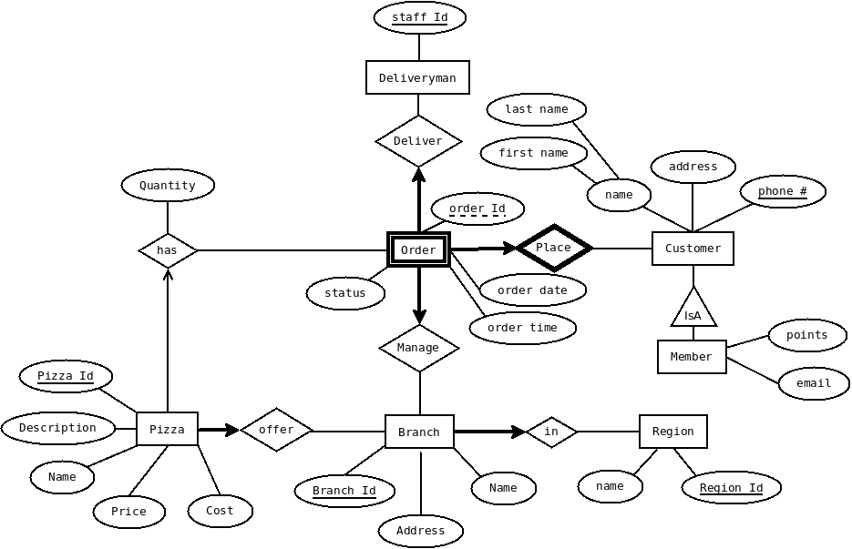

# PHPizza

PHPizza is an online pizza ordering system built with the PHP Laravel framework and MySQL database.

Project for CPSC 304 Introduction to Relational Databases

## Project Description

The domain we will be modeling is online pizza ordering.

The database will store information about customers, stores, orders and deliveries.
The system will have three types of users: customers, delivery men and managers.

Customers place orders. They have the attributes name(first+last), phone# and address. To order a pizza, a customer will select a branch (most likely the nearest one), and the system will display a list of menu items available at that branch. The customer will then select the type and quantity of pizzas they wish to order, and proceed to provide their contact information.

Customers can sign up for membership. To apply for membership, the customer provides their name, phone# and address. Members have additional attributes: points, email address.

Each region has a number of store branches, and branches offer different kinds of pizza. A branch has the attributes branch_id, address and branch name. The cost and price of the pizza may also differ based on location. Each pizza has a unique pizza id, name, price, cost and description.

Each order has a unique order id, date and time, and a status code indicating whether the order has been delivered or not. An order consists of several items (corresponding to different types of pizza), and each item has the attributes quantity and discount.

A delivery man with a unique staff_id delivers orders. Orders are assigned to the delivery team automatically by the system. Each delivery man can see the list of orders they have been assigned. When the ordered items are delivered to the customer and payment is completed, the delivery man marks the order status as completed.


## Platform

We use PHP to create a simple webapp interface for our application. We make use of the framework Laravel to assist with tasks like templating and URL routing, but we aren't using an ORM or any kind of object-database mapper.

## Deployment and Running
See [blog post](https://junzew.github.io/blog/php/mysql/ubuntu/ec2/lamp/2018/01/06/Deploying-a-database-application-to-LAMP-stack.html) on how to deployment to an AWS EC2 instance.

Start the server with:
`php artisan serve`

## ER Diagram



## Database Schema
```
CREATE TABLE customer(
	phone VARCHAR(255) PRIMARY KEY,
	address VARCHAR(255),
	first_name VARCHAR(255),
	last_name VARCHAR(255)
);
CREATE TABLE member(
	phone VARCHAR(255) PRIMARY KEY,
	points INT,
	email VARCHAR(255) UNIQUE,
	password VARCHAR(20),
	FOREIGN KEY (phone) REFERENCES customer(phone)
);
CREATE TABLE region(
	region_id INT PRIMARY KEY,
	name VARCHAR(255)
);
CREATE TABLE branch(
	branch_id INT PRIMARY KEY,
	name VARCHAR(255),
	address VARCHAR(255),
	region_id INT NOT NULL,
	FOREIGN KEY (region_id) REFERENCES region(region_id)
);
CREATE TABLE deliveryman(
	staff_id INT PRIMARY KEY,
	branch_id INT,
	password VARCHAR(20),
	FOREIGN KEY (branch_id) REFERENCES branch(branch_id)
);
CREATE TABLE orderlist(
	order_id INT,
	order_date DATE,
	order_time TIMESTAMP,
	status INT,
	points_used INT,
	phone VARCHAR(255),
	staff_id INT NOT NULL,
	branch_id INT NOT NULL,
	PRIMARY KEY (order_id),
	FOREIGN KEY (staff_id) REFERENCES deliveryman(staff_id),
	FOREIGN KEY (branch_id) REFERENCES branch(branch_id),
	FOREIGN KEY (phone) REFERENCES customer(phone)
);
CREATE TABLE pizzatype(
	type_id INT PRIMARY KEY,
	name VARCHAR(255),
	description VARCHAR(255)
);
CREATE TABLE menuitem(
	branch_id INT,
	pizza_number INT,
	price DECIMAL(10,2),
	cost DECIMAL(10,2),
	type_id INT,
	PRIMARY KEY (branch_id, pizza_number),
	FOREIGN KEY (type_id) REFERENCES pizzatype(type_id)
);
CREATE TABLE toppingitem(
	topping_id INT PRIMARY KEY,
	price DECIMAL(10,2),
	cost DECIMAL(10,2),
	t_name VARCHAR(255)
);
CREATE TABLE toppingset(
	topset_id INT PRIMARY KEY
);
CREATE TABLE includestop(
	topset_id INT,
	topping_id INT,
	quantity INT,
	PRIMARY KEY(topset_id, topping_id),
	FOREIGN KEY(topset_id) REFERENCES toppingset(topset_id),
	FOREIGN KEY(topping_id) REFERENCES toppingitem(topping_id)
);
CREATE TABLE orderitem(
	order_id INT,
	oitem_id INT,
	topset_id INT,
	pizza_number INT,
	oitem_quantity INT,
	branch_id INT,
	PRIMARY KEY (order_id, oitem_id),
	FOREIGN KEY (order_id) REFERENCES orderlist(order_id),
	FOREIGN KEY (topset_id) REFERENCES toppingset(topset_id),
	FOREIGN KEY (branch_id, pizza_number) REFERENCES menuitem(branch_id, pizza_number)
);
```

## Application Specifications

1. View pizza options

  User: Customer

  Input: branch id

  Output: A list of pizza options

  Basic Case: Display all the available pizza options offered at the given branch.

2. Place order

  User: Customer

  Input: customer name, phone number, address, pizza id, quantity

  Output: "OK" or "Error, order is empty."

  Basic Case: Insert a new order record into the database with a unique ID, along with the current date and time. Automatically assign the order to an available delivery man. Calculate the total price and display to the customer.

  Exceptions:
If the customer tries to place an empty order, return “Error, order is empty”.

3. Sign up for membership

  User: Customer

  Input: customer name, phone number, address, email address

  Output: "OK" or "Error, already a member"

  Basic Case:  If the customer is not a member, register the customer by inserting a new record into the member table, then return "OK".

  Exceptions: If the customer is already a member, return “Error, already a member”.

4. View membership information

  User: Customer

  Input: email address

  Output: Membership information including total number of points, “Error, not a member”

  Basic Case: Find the member with the given email address and return their membership information

  Exceptions: If the customer is not a member, return “Error, not a member”.

5. List orders for a local branch

  User: Manager

  Input: branch id

  Output: A list of orders

  Basic Case: Displays a list of active orders at the given branch.

6. View the assigned list of orders to be delivered

  User: Delivery Man

  Input: staff id

  Output: A list of orders

  Basic Case: Displays a list of active orders assigned to the given delivery man.

7. Complete order

  User: Delivery Man

  Input: order id

  Output: "Ok" or "Error, order has been complete"

  Basic Case: If the order status is not completed, mark the order as completed and return "OK".

  Exceptions: If the order status is already completed, return "Error, order has been completed"

8. Add new pizza to menu

  User: Manager

  Input: name, price, cost, image url, branch id

  Output: "OK" or "Error, pizza already added."

  Basic Case: Inserts a new pizza record with the given information and returns "OK".

  Exceptions: If there is already a pizza with the given name at that branch, return "Error, pizza already added".

9. Update pizza information

  User: Manager

  Input: name, price, cost, image url, branch id

  Output: "OK" or "Error, pizza does not exist"

  Basic Case: If a pizza with given name exists at the given branch, update the existing record with the given information and return “Ok”.

  Exceptions: If no pizza record exists, return "Error, pizza does not exist"

10. Delete pizza from menu

  User: Manager

  Input: name, branch id

  Output: "Deleted" or "Error, pizza does not exist"

  Basic Case: Deletes the pizza with the given name and branch, returns "Deleted".

  Exceptions: If the pizza does not exist in the menu, return "Error, pizza does not exist"
